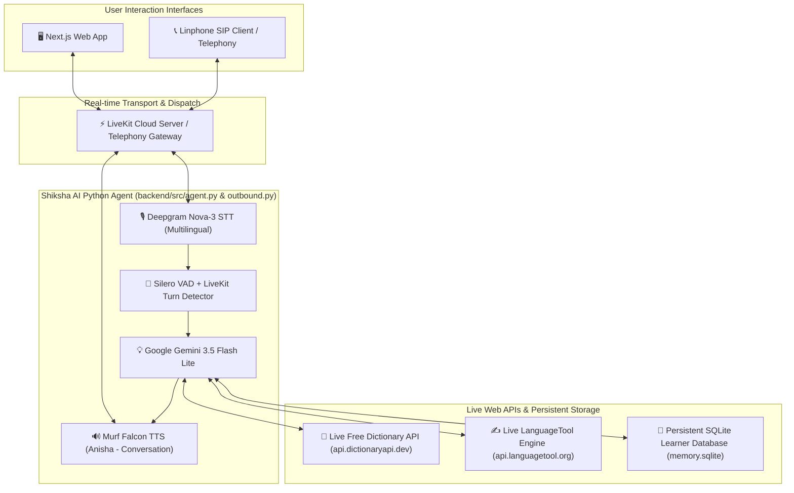

# Shiksha AI (शिक्षा AI) — Spoken English Voice Tutor for Bharat

[](https://murf.ai)
[](https://murf.ai)
[-6366F1)](https://murf.ai/api/docs/text-to-speech/streaming)
[](https://deepgram.com)
[](https://aistudio.google.com)
[](https://docs.livekit.io/telephony)

**Shiksha AI** is a patient, warm, and interactive spoken English tutor built for learners across India. Powered by **Murf Falcon TTS** (the world's fastest streaming TTS API) and **LiveKit Agents**, Shiksha AI helps users practice conversational English, look up live word definitions, analyze sentence grammar, remember past learner progress, and receive daily outbound practice calls over SIP telephony.

---

## 🌟 Architecture Diagram



---

## 📅 Challenge Progress & Implementation Matrix

### 🚀 Day 1 – The Setup (Voice Pipeline Foundation)
- Integrated **LiveKit Agents SDK** (~1.4) with **Murf Falcon TTS** (`voice="Anisha"`, `style="Conversation"`).
- Configured **Deepgram Nova-3** (`language="multi"`) for multilingual Indian speech-to-text.
- Connected **Google Gemini 3.5 Flash Lite** for ultra-fast, low-latency conversational responses.

### 🎨 Day 2 – The Look (UI & Glowing Aura Orb)
- Custom dark glassmorphism web UI (`frontend/`).
- Customized LiveKit visualizer to **Glowing Aura Orb** (`'aura'`).
- Interactive collapsible chat transcript toggle (`💬`) defaulted to clean visualizer view.
- Prominent branding badges for **Learning & Literacy** and **Voice for Bharat 2026**.

### 🎛️ Day 3 – The Control (State & Audio Toolbar)
- Top status pill displaying real-time agent states (`🔊 Shiksha AI is speaking...`, `🎙️ Listening...`, `🧠 Thinking...`).
- Audio control toolbar for microphone toggle, volume, and clean session disconnect.

### 💾 Day 4 – The Memory (SQLite Persistent Learner Profiles)
- Built persistent SQLite database (`backend/db/memory.sqlite`) storing learner progress:
  - Learner name, level (`Beginner`, `Intermediate`), topics covered, and common mistakes.
- **Proactive User Consent**: Demands explicit consent before saving any personal details.
- **Native Script Rule**: Strictly requires non-English words to be output in native script (e.g., Hindi in Devanagari: **नमस्ते**).
- Dynamic greeting based on stored memory records.

### 🌐 Day 5 – The Tools & Live Web Lookup
- **Data Source Disclosure**: All domain lookup tools connect to **100% LIVE public Web APIs**. No dummy local datasets are used for lookups.
  - 📖 **Live Word Definition Lookup** (`lookup_word_definition`): Fetches live definitions, parts of speech, phonetics, and example sentences from the [Free Dictionary API](https://api.dictionaryapi.dev).
  - ✍️ **Live Grammar Analysis** (`check_sentence_grammar`): Checks real-time sentence grammar and suggestions via the [LanguageTool Engine](https://api.languagetool.org).
- **Graceful Spoken Offline Fallback**: Handles network outages gracefully out loud in warm spoken words without going silent or outputting raw JSON errors.
- **Real-time UI Domain Data Cards**: Pushes live fetched dictionary/grammar data packets directly to the web UI, rendering elegant glassmorphism cards below the visualizer.
- **⚡ Fallback Test Switch**: iOS-style horizontal sliding toggle on the frontend allowing instant live simulation of API network failure during demos and testing.

### 📞 Day 6 – Make Outbound Calls (SIP Telephony & Linphone)
- Created standalone outbound call script (`backend/src/outbound.py`) for scheduled daily practice calls.
- **Step 4 Mandatory Opening Script Compliance**:
  1. *Who is calling*: *"Namaste! I am Shiksha AI, your spoken English learning buddy."*
  2. *Why calling*: *"I am calling for your scheduled daily English speaking practice session."*
  3. *How to opt out*: *"If you do not want to receive these daily practice calls, just tell me to stop or unsubscribe."*
- Dispatches SIP outbound calls to Linphone clients (`sip:cheese-cheese@sip.linphone.org`) via LiveKit Telephony Trunking (`ST_7Bgf2f6Cm5Bs`).
- Automatically triggers Murf Falcon TTS opening speech upon audio track subscription.

---

## 📢 Data Source Disclosure (Day 5 Mandate)

> [!IMPORTANT]
> **Data Origin Notice**:
> All dictionary definitions and grammar rules used by Shiksha AI are fetched **LIVE** over the internet at runtime:
> 1. **Free Dictionary API**: `https://api.dictionaryapi.dev/api/v2/entries/en/<word>` (Live)
> 2. **LanguageTool Engine**: `https://api.languagetool.org/v2/check` (Live)
> 
> No offline/dummy fallback data is hardcoded into lookups. If a live API experiences network timeouts or simulated offline mode is toggled, Shiksha AI executes its graceful spoken fallback—explaining the word directly in its own warm spoken words while alerting the user visually via the UI data card.

---

## 🛠️ Repository Structure

```
murf-livekit-starter/
├── backend/
│   ├── db/
│   │   ├── memory.sqlite        # SQLite persistent learner database
│   │   └── schema.sql           # Database schema definition
│   ├── src/
│   │   ├── agent.py             # Main LiveKit voice agent entrypoint (Inbound)
│   │   ├── outbound.py          # Day 6 Outbound SIP call agent entrypoint
│   │   ├── db.py                # Database wrapper functions
│   │   └── tools.py             # Live Web API integrations (Free Dict & LanguageTool)
│   ├── tests/
│   │   ├── test_day4_memory.py  # Unit tests for SQLite memory & consent
│   │   ├── test_day5_tools.py   # Unit tests for Live Web APIs & simulated offline mode
│   │   └── test_day6_outbound.py# Unit tests for SIP outbound script compliance
│   ├── pyproject.toml           # Python dependencies (managed via uv)
│   └── .env.local               # Environment variables
├── frontend/
│   ├── app/                     # Next.js pages and token API endpoint
│   ├── components/              # UI components (agents-ui, visualizers, data cards)
│   ├── app-config.ts            # Branding and accent color config
│   └── package.json             # Frontend dependencies (managed via pnpm)
├── challenges/                  # Challenge task reference files (Day 1 - Day 6)
└── README.md                    # Project documentation
```

---

## ⚙️ Setup & Running Locally

### 1. Prerequisites
- **Python 3.10+** with **[uv](https://docs.astral.sh/uv/)** package manager
- **Node.js 18+** with **pnpm**
- **Linphone** (for testing Day 6 SIP outbound calls)

### 2. Environment Variables (`backend/.env.local`)
Copy `backend/.env.example` to `backend/.env.local` and add:
```env
LIVEKIT_URL=wss://your-livekit-domain.livekit.cloud
LIVEKIT_API_KEY=your_livekit_api_key
LIVEKIT_API_SECRET=your_livekit_api_secret

MURF_API_KEY=your_murf_api_key
DEEPGRAM_API_KEY=your_deepgram_api_key
GOOGLE_API_KEY=your_gemini_api_key

# Telephony (Day 6 Outbound SIP)
SIP_TRUNK_ID=ST_7Bgf2f6Cm5Bs
MY_SIP_URI=sip:cheese-cheese@sip.linphone.org
```

### 3. Run Backend & Frontend

#### Terminal 1 — Python Voice Agent (Inbound Web App):
```bash
cd backend
uv sync
uv run python src/agent.py dev
```

#### Terminal 2 — Next.js Frontend UI:
```bash
cd frontend
pnpm install
pnpm dev
```
Open **`http://localhost:3000`** in your browser and start talking!

#### Outbound SIP Practice Call (Day 6):
Ensure Linphone app is open and registered to `sip:cheese-cheese@sip.linphone.org`, then run:
```bash
cd backend
uv run python src/outbound.py
```

---

## 🧪 Running Unit Tests

Run the full automated test suite (10/10 tests passing):
```bash
cd backend
uv run pytest
```

Run ruff linting & formatting:
```bash
cd backend
uv run ruff check .
uv run ruff format .
```

---

## 📜 License

MIT License © 2026 Voice for Bharat Challenge
